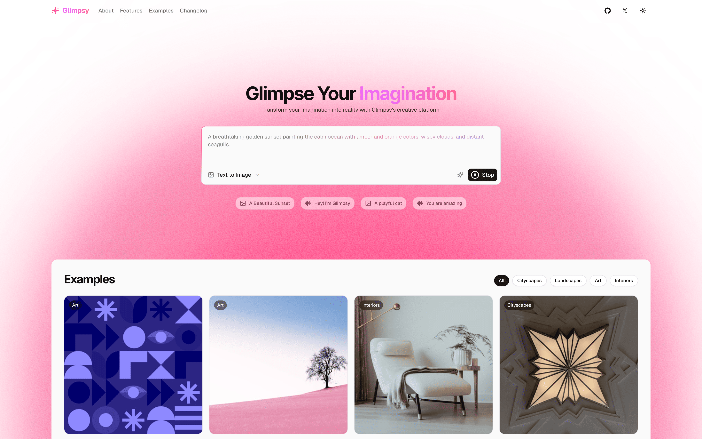

# ✨ Glimpsy



> **Your Creative Assistant** - Transform ideas into stunning visuals and natural speech with AI

**Glimpsy** is a creative assistant that allows you to create images and text-to-speech. Built for creators who value quality, speed, and simplicity.

## 🚀 Features

- **🎨 AI Image Generation** - Transform text into stunning visuals in seconds
- **🎙️ Text-to-Speech** - Convert any text into natural-sounding speech
- **⚡ Lightning Fast** - Generate content in seconds, not minutes
- **🔒 Privacy First** - Your creations are yours - we don't store or track
- **📱 Modern Interface** - Beautiful, responsive design that works everywhere
- **💾 Easy Export** - Download in high quality formats instantly

## 🌟 Perfect For

- **Content Creation** - Social media, blogs, marketing materials
- **Accessibility** - Making content more inclusive with audio
- **Creative Projects** - Bringing artistic visions to life
- **Business Growth** - Scale content production efficiently

## 🛠️ Tech Stack

- **Frontend**: Next.js, React, TypeScript
- **Styling**: Tailwind CSS
- **Animations**: Framer Motion
- **UI Components**: shadcn/ui
- **Package Manager**: Bun

## 🚦 Getting Started

```bash
# Clone the repository
git clone https://github.com/sachigoyal/glimpsy.git

# Navigate to project
cd glimpsy

# Install dependencies
bun install

# Start development server
bun dev
```

## 🎯 Usage

1. **Describe Your Vision** - Type what you want to create in natural language
2. **AI Magic Happens** - Advanced AI models process your request in seconds
3. **Enjoy & Share** - Download and use your high-quality creations

## 🌐 Live Demo

Visit [glimpsy.sachii.dev](https://glimpsy.sachii.dev) to try it yourself - no signup required!

## 👥 Contributors

- **[Sachi Goyal](https://sachii.dev)** - [@sachigoyal](https://x.com/sachigoyal27)
- **[Rudro](https://rdsx.dev)** - [@rudrodip](https://x.com/rds_agi)

## 📄 License

[MIT License](./LICENSE)

---

<div align="center">

**[🌟 Try Glimpsy Now](https://glimpsy.sachii.dev)** • **[🐛 Report Issues](https://github.com/sachigoyal/glimpsy/issues)** • **[💬 Follow Updates](https://x.com/sachigoyal27)**

*Built with ❤️ for creators worldwide*

</div>
